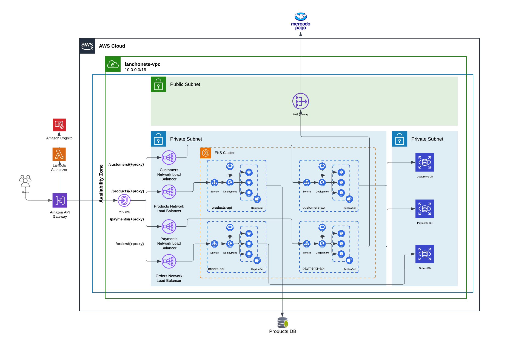
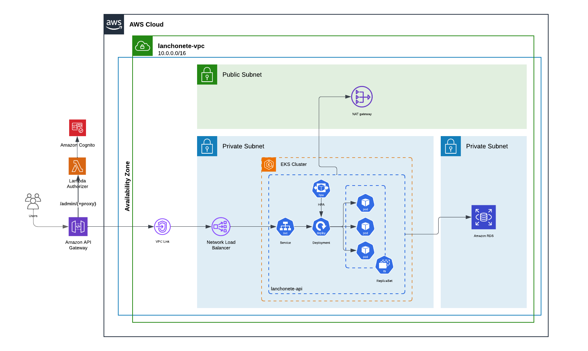

# 8SOAT FIAP Tech Challenge | Grupo 41
<!--

**Here are some ideas to get you started:**

🙋‍♀️ A short introduction - what is your organization all about?
🌈 Contribution guidelines - how can the community get involved?
👩‍💻 Useful resources - where can the community find your docs? Is there anything else the community should know?
🍿 Fun facts - what does your team eat for breakfast?
🧙 Remember, you can do mighty things with the power of [Markdown](https://docs.github.com/github/writing-on-github/getting-started-with-writing-and-formatting-on-github/basic-writing-and-formatting-syntax)
-->

## Fase 4
## Repositorios
1. Repo Payments: [Tech Challenge Fase 4 Payments](https://github.com/8SOAT-GRUPO-41/tech-challenge-fase-4-payments)
2. Repo Orders: [Tech Challenge Fase 4 Orders](https://github.com/8SOAT-GRUPO-41/tech-challenge-fase-4-orders)
3. Repo Products: [Tech Challenge Fase 4 Products](https://github.com/8SOAT-GRUPO-41/tech-challenge-fase-4-products)
4. Repo Customers: [Tech Challenge Fase 4 Customers](https://github.com/8SOAT-GRUPO-41/tech-challenge-fase-4-customers)
5. Repo DB: [Tech Challenge Fase 4 DB](https://github.com/8SOAT-GRUPO-41/tech-challenge-fase-3-db)
6. Repo IAC: [Tech Challenge Fase 4 IAC](https://github.com/8SOAT-GRUPO-41/tech-challenge-fase-3-iac)
7. Repo Lambda Authorizer: [Tech Challenge Fase 4 Lambda Authorizer](https://github.com/8SOAT-GRUPO-41/tech-challenge-fase-3-lambda)

### Arquitetura Fase 4

### Vídeo fase 4
[Assista o vídeo](https://youtu.be/Mgy5OzQbONw?si=FoaSGl6vh6n7-naq)

## Fase 3

### Arquitetura Fase 3

### Vídeo fase 3
[Assista o vídeo](https://youtu.be/KqPtQx3bTxE)
