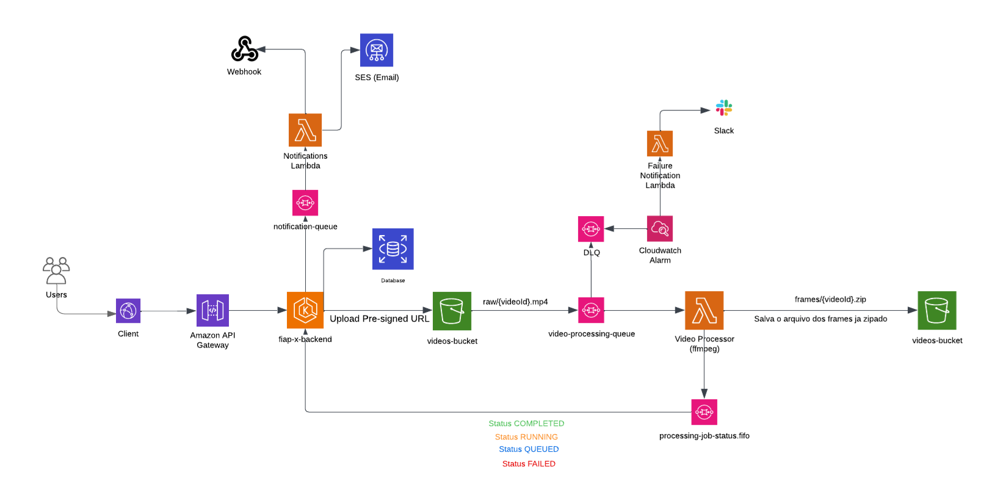

# 8SOAT FIAP | Grupo 41

# Hackathon - FIAP X
## Repositorios
1. Repo Backend Core: [Hackathon Backend Core](https://github.com/8SOAT-GRUPO-41/hackathon-backend)
2. Repo Frontend: [Hackathon Frontend](https://github.com/8SOAT-GRUPO-41/hackathon-frontend)
3. Repo Notifications Lambda: [Hackathon Notifications Lambda](https://github.com/8SOAT-GRUPO-41/hackathon-notifications-lambda)
4. Repo Video Processor: [Hackathon Video Processor](https://github.com/8SOAT-GRUPO-41/hackathon-video-processor)
5. Repo IAC: [Hackathon IAC](https://github.com/8SOAT-GRUPO-41/hackathon-iac)

## Arquitetura

### Vídeo
[Assista o vídeo]()

# Tech Challenge

## Fase 4
## Repositorios
1. Repo Payments: [Tech Challenge Fase 4 Payments](https://github.com/8SOAT-GRUPO-41/tech-challenge-fase-4-payments)
2. Repo Orders: [Tech Challenge Fase 4 Orders](https://github.com/8SOAT-GRUPO-41/tech-challenge-fase-4-orders)
3. Repo Products: [Tech Challenge Fase 4 Products](https://github.com/8SOAT-GRUPO-41/tech-challenge-fase-4-products)
4. Repo Customers: [Tech Challenge Fase 4 Customers](https://github.com/8SOAT-GRUPO-41/tech-challenge-fase-4-customers)
5. Repo DB: [Tech Challenge Fase 4 DB](https://github.com/8SOAT-GRUPO-41/tech-challenge-fase-3-db)
6. Repo IAC: [Tech Challenge Fase 4 IAC](https://github.com/8SOAT-GRUPO-41/tech-challenge-fase-3-iac)
7. Repo Lambda Authorizer: [Tech Challenge Fase 4 Lambda Authorizer](https://github.com/8SOAT-GRUPO-41/tech-challenge-fase-3-lambda)

### Arquitetura Fase 4

### Vídeo fase 4
[Assista o vídeo](https://youtu.be/Mgy5OzQbONw?si=FoaSGl6vh6n7-naq)

## Fase 3

### Arquitetura Fase 3

### Vídeo fase 3
[Assista o vídeo](https://youtu.be/KqPtQx3bTxE)
